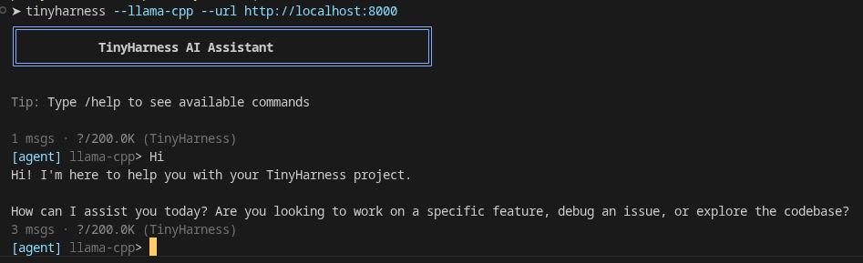

# TinyHarness

Lightweight AI assistant framework in Rust with pluggable LLM providers (Ollama, llama.cpp, vLLM), built-in tool calling, and agent skills.



## Features

- **Pluggable Providers**: Ollama, llama.cpp, and vLLM — plus any OpenAI-compatible API. Swap backends without changing application code.
- **Tool System**: Modular tools (`ls`, `read`, `write`, `edit`, `grep`, `glob`, `run`, `web_search`, `web_fetch`, `auto_compact`, `invoke_skill`, `switch_mode`, `question`) that the AI calls to interact with your filesystem, run commands, or search the web.
- **Agent Modes**: Four modes — `casual` (no tools), `planning` (read-only), `agent` (full access), and `research` (web-focused) — to control what the AI can do.
- **Skills**: Pluggable skill modules that inject specialized instructions into the conversation for specific tasks (e.g. PDF processing, image analysis).
- **Context Management**: Token estimation, context-window load warnings at 70%/90%, and cascading conversation compaction via `/compact`.
- **Session Persistence**: JSONL-based sessions with UUIDs, saved in `~/.local/share/tinyharness/sessions/`.
- **Async Streaming**: Built on `tokio` for efficient streaming communication with LLM APIs.
- **Interactive CLI**: Color-coded terminal interface with `/` slash commands for session management, configuration, and tool control.

## Getting Started

### Prerequisites

- [Rust](https://www.rust-lang.org/tools/install) (latest stable, edition 2024)
- At least one LLM backend running locally:
  - [Ollama](https://ollama.com/) (default)
  - [llama.cpp](https://github.com/ggml-org/llama.cpp) server
  - [vLLM](https://github.com/vllm-project/vllm)

### Installation

```bash
git clone https://github.com/yourusername/TinyHarness.git
cd TinyHarness
make install
```

This builds in release mode and copies the binary to `~/.local/bin`. Make sure `~/.local/bin` is in your `$PATH`:

```bash
export PATH="$HOME/.local/bin:$PATH"
```

To uninstall:

```bash
make uninstall
```

Alternatively, install via Cargo:

```bash
cargo install --path .
```

### Usage

**Ollama** (default):
```bash
tinyharness
```
Connects to `http://127.0.0.1:11434`.

**llama.cpp**:
```bash
tinyharness --llama-cpp
```
Connects to `http://127.0.0.1:8080` by default.

**vLLM**:
```bash
tinyharness --vllm
```
Connects to `http://127.0.0.1:8000` by default.

A health check runs on startup to verify the provider is reachable.

**Custom URL** (works with any provider):
```bash
tinyharness --llama-cpp --url http://localhost:2832
tinyharness --ollama --url http://192.168.1.50:11434
tinyharness --vllm --url http://gpu-server:8000
```

### CLI Arguments

| Flag | Description |
|---|---|
| `-o`, `--ollama` | Use the Ollama provider (default) |
| `-l`, `--llama-cpp` | Use the llama.cpp provider |
| `-v`, `--vllm` | Use the vLLM provider |
| `-u`, `--url` | Custom base URL for the provider |

## Agent Modes

| Mode | Tools Available | Purpose |
|------|----------------|---------|
| **casual** | None | Pure chat, no filesystem access |
| **planning** | `ls`, `read`, `grep`, `glob`, `web_search`, `switch_mode`, `question` | Analyze & plan, then escalate to agent |
| **agent** | All tools | Full development access — code, commands, web |
| **research** | `web_search`, `web_fetch`, `ls`, `read`, `grep`, `glob`, `switch_mode`, `question` | Web research, then escalate for execution |

Switch modes with `/mode <name>` or let the AI request escalation via `switch_mode`.

## Slash Commands

| Command | Description |
|---------|-------------|
| `/help` | Show available commands |
| `/mode [casual\|planning\|agent\|research]` | Switch agent mode |
| `/compact [focus]` | Summarize older messages (cascading for long sessions) |
| `/session [list\|new\|switch\|rename]` | Manage conversation sessions |
| `/settings [summary\|all]` | Show configuration (`all` for full safe-command list) |
| `/command [list\|add\|rm\|deny\|undeny\|reset]` | Manage auto-accepted and denied commands |
| `/model [name]` | List or switch models |
| `/apikey [key]` | Set/show/clear Ollama API key (needed for `web_search`) |
| `/add <file>`, `/drop <file>`, `/files`, `/dropall` | Pin/unpin files into context |
| `/context` | Show auto-detected project context |
| `/init` | Generate or update `TINYHARNESS.md` |
| `/clear` | Clear terminal screen |
| `/exit` | Quit |

### Command Management

The `/command` system controls which shell commands are auto-accepted:

```
/command list          # Show safe and denied commands
/command add <cmd>     # Add a command to auto-accept list
/command rm <cmd>      # Remove from auto-accept list
/command deny <cmd>    # Add to deny list (always requires confirmation)
/command undeny <cmd>  # Remove from deny list
/command reset         # Reset safe commands to defaults
/command resetdeny     # Clear the deny list
```

Safe commands are shown 3 per row with markers: `·` for defaults, `+` for user-added.
Cross-list warnings alert you if a command appears on both lists.

### Session Compaction

`/compact` summarizes older messages to free context space. Sessions over 60% of the context window use cascading compaction (chunking + merging) to handle very long conversations.

```
/compact focus on build errors and fixes
Cascading compaction: 580 intermediate messages → 12 stages (50 messages/stage)
  Stage 1/12: Compacting messages 1–50...
  ...
  Merging 12 summaries into final summary...
Compacted: 600 messages → 6 messages
```

On session load, TinyHarness warns if the conversation exceeds 70% or 90% of the context window.

## Skills

Skills are pluggable instruction modules that give the AI specialized knowledge for specific tasks. Invoke a skill with the `invoke_skill` tool, and its instructions are injected into the conversation.

Skills are discovered from:
- `~/.config/tinyharness/skills/` (user skills)
- `skills/` in the current project directory (project skills)

## Project Structure

TinyHarness is a Cargo workspace with two crates:

### Library crate (`tinyharness-lib/`)

Frontend-agnostic — no terminal I/O, no ANSI codes, no rustyline.

```
tinyharness-lib/src/
├── lib.rs              Re-exports all public types
├── provider/           Provider trait + implementations (ollama, llama_cpp, vllm, openai_compat)
├── config/mod.rs       Settings persistence (provider, model, mode, API key, denied commands)
├── mode.rs             AgentMode enum with system prompts
├── context.rs          WorkspaceContext — auto-detected project metadata + TINYHARNESS.md loading
├── session.rs          JSONL session persistence with UUIDs
├── token.rs            Token estimation and context window calculations
├── skill.rs            Skill discovery and registry
└── tools/              Tool implementations (ls, read, write, edit, grep, glob, run, web_search, etc.)
```

### Binary crate (`src/`)

Terminal-UI layer — CLI parsing, interactive prompts, ANSI output.

```
src/
├── main.rs             Entry point, CLI parsing, provider creation
├── agent.rs            Main interaction loop, tool dispatch, confirmation UI, context warnings
├── style.rs            ANSI color constants
├── commands/           Slash command handlers (help, mode, compact, session, settings, etc.)
└── ui/                 Terminal UI helpers (confirmation prompts, input, diffs)
```

## Development

### Build & Test

```bash
cargo build                    # Debug build
cargo build --release          # Release build
cargo test --workspace         # Run all tests
cargo clippy --workspace -- -D warnings   # Lint
cargo fmt --all -- --check     # Format check
cargo fmt --all                # Auto-format
```

### Verification Steps

After making changes, run:

1. `cargo fmt --all` — ensure formatting is clean
2. `cargo clippy --workspace -- -D warnings` — no clippy warnings
3. `cargo test --workspace` — all tests pass
4. `cargo build` — clean release build succeeds

## AI Usage & Security

TinyHarness grants LLMs the ability to interact with your filesystem through tool calling. This introduces specific risks:

- **Sandboxing**: Run within a sandboxed environment (Docker container, VM) to prevent unintended modifications.
- **Non-determinism**: LLMs may hallucinate or produce incorrect tool arguments. Always review proposed actions.
- **Accountability**: You assume full responsibility for all operations performed by the AI. Ensure you have backups.

The `run` tool can never be auto-accepted — even with auto-accept mode — unlike `write` and `edit`.

## Project Instructions (TINYHARNESS.md)

TinyHarness automatically discovers project instruction files, similar to `CLAUDE.md` in Claude Code and `AGENTS.md` in other agents. These files give the AI persistent context about your project.

### Discovery

Searches from the current directory up to the filesystem root (first match wins):

| Priority | File | Notes |
|---|---|---|
| 1 | `TINYHARNESS.md` | TinyHarness-native |
| 2 | `.tinyharness.md` | Hidden variant |
| 3 | `AGENTS.md` | Industry standard (60K+ repos) |
| 4 | `CLAUDE.md` | Claude Code compatibility |

Files over 20,000 characters are truncated (70% head / 20% tail with a marker).

### Generating with `/init`

Run `/init` in a TinyHarness session and the AI will analyze your project and generate a `TINYHARNESS.md`:

```
[agent]> /init
  Generating project instruction file...
  ✦ Created /path/to/TINYHARNESS.md (45 lines)
```

If one already exists, `/init` updates it — keeping accurate parts, removing outdated ones, and adding what's missing.

### What to Include

A good instruction file should contain what you'd tell a new teammate:

- **Build and test commands** — specific ones, not vague
- **Code conventions** — rules that differ from defaults
- **Architecture** — key directories and module relationships
- **Known gotchas** — things that trip up newcomers
- **Verification steps** — what to run after making changes

Keep it concise (under 200 lines). For detailed reference, the AI can use `read` on specific files.
